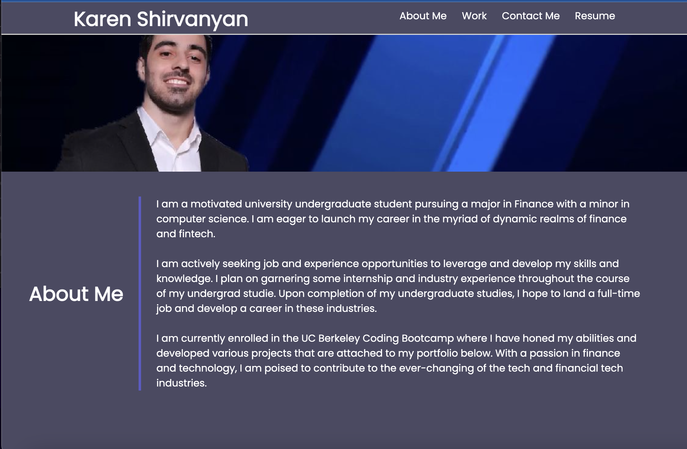
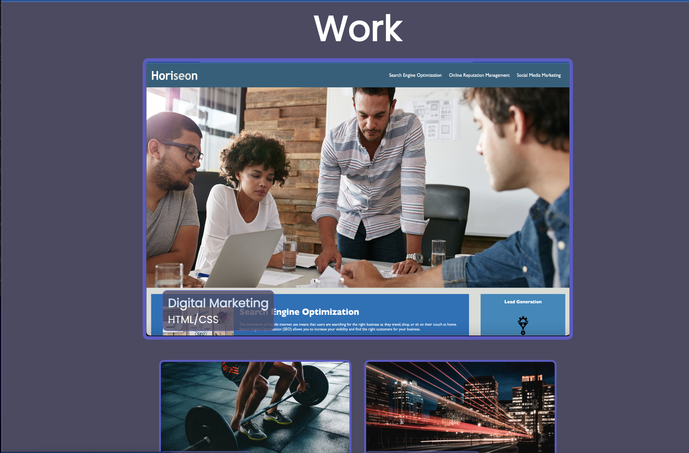

# Challenge 2 Professional Portfolio

## Technology Used, Deployment, and Repository

| Technology Used         | Resource URL           | 
| ------------- |:-------------:| 
| HTML    | [https://developer.mozilla.org/en-US/docs/Web/HTML](https://developer.mozilla.org/en-US/docs/Web/HTML) | 
| CSS     | [https://developer.mozilla.org/en-US/docs/Web/CSS](https://developer.mozilla.org/en-US/docs/Web/CSS)      |   
| Git | [https://git-scm.com/](https://git-scm.com/)     | 
| Deployed Site | [https://shirvanyankaren.github.io/Challenge1/](https://shirvanyankaren.github.io/Challenge1/)     | 
| My Github Repository | [https://github.com/ShirvanyanKaren/Challenge1](https://github.com/ShirvanyanKaren/Challenge1/)     | 

## Description
The intent of this projext was to create a professional portfolio with CSS and HTML to display a profile for my industry experience with information about myself, my professional projects, and links to those professional projects.



The deployed portfolio above was accomplished by following the listed acceptance criteria:

Portfolio Creation
GIVEN I need to sample a potential employee's previous work
WHEN I load their portfolio
THEN I am presented with the developer's name, a recent photo or avatar, and links to sections about them, their work, and how to contact them
WHEN I click one of the links in the navigation
THEN the UI scrolls to the corresponding section
WHEN I click on the link to the section about their work
THEN the UI scrolls to a section with titled images of the developer's applications
WHEN I am presented with the developer's first application
THEN that application's image should be larger in size than the others
WHEN I click on the images of the applications
THEN I am taken to that deployed application
WHEN I resize the page or view the site on various screens and devices
THEN I am presented with a responsive layout that adapts to my viewport

## Table of Contents

* [HTML and CSS Code](#HTML-CSS)
* [Usage](#usage)
* [Learning Points](#learning-points)
* [Credits](#credits)
* [License](#license)

## HTML and CSS Code

To meet the acceptance criteria of including my name, a picture of myself and links to all of portfolio sections, I inputted the html code with href links to each section. This was exectuted under the HTML element "nav" and "header" that included the class ids to configure them in CSS

```html
<header class="top-nav">
  <h1>Karen Shirvanyan</h1>
  <nav>
    <ul>
      <!-- added references and links to them -->
      <li><a href="#about">About Me</a></li>
      <li><a href="#work">Work</a></li>
      <li><a href="#contact">Contact Me</a></li>
      <li><a href="#resume">Resume</a></li>
    </ul>
  </nav>
</header>
<hr>
<!-- Added Image of myself -->
<section class="banner">
</section> 
```

For each sections of the navigation portion of the portfolio I included id classes that linked the names to their corresponding section.

```html
<div class="column" id="resume"> for resume

<section class="port-work" id="work"> for work

<section class="bottomNav" id="contact"> for contact
```

To address the larger first image and deployed websit of the projects, I created an <a> tag around the image and inserted the appropriated links for the website and repository in the caption.


 ```html
 /<div class="work large-image">
        <a href="https://shirvanyankaren.github.io/Challenge1/" target="_blank">
          
        </a>
        <div class="links">
          <a href="https://github.com/ShirvanyanKaren/Challenge1" target="_blank">
            <figcaption>
              <h3>Digital Marketing</h3>
              <p>HTML/CSS</p>
            </figcaption> 
```

This step also included creating a flexbox in CSS for the images and aligning them as columns, while also creating a seperate class tag for the first image to make it larger than the rest.

Finally, I addressed the deployment of the site on different displays using media query where I aligned the proportions of the elements to make them more suitable for tablet and smartphone users.

``` css
/* Created media query for difference screen sizes  */
@media screen and (max-width: 768px) {
  .top-nav {
    display: block;
    text-align: center;
  }

  .container {
    display: block;
    justify-content: center;
    margin-bottom: 5px;

  }

  .page {
    width: 95%;
  }

  .container h2 {
    text-align: center;
  }
```

## Usage

The usage of this application can incredibly beneficial for the development of a professional portfolio. The following is the first image of the portfolio that links to the first project through the image href and the repository for the application through the caption href.



The following picture is the laucnched application of the first project and its repository through the links directory.


## Learning Points

Through this project, I was introduced to a myriad of new skills and HTML/CSS configurations that help design the page and it's content. I learned how to properly add href and id tags for links as well as media queries and utilizng flex box and pseudo elements within CSS. I ran into a lot of issues trying to configure the portfolio and it's proportions which is where DevOp tools in Chrome played a huge part in helping me debug and see where I went wrong.

## Credits

Jeyhun Jung from the Central Tutor Center helped a lot with configuring the proportions of the page with media queries and setting up my href tags properly.

I also referred to the following resources:
*[Media Query](https://developer.mozilla.org/en-US/docs/Web/CSS/Media_Queries/Using_media_queries)
*[Flex Box Configuration](https://developer.mozilla.org/en-US/docs/Web/CSS/CSS_Flexible_Box_Layout/Basic_Concepts_of_Flexbox)
*[Pseudo Elements](https://developer.mozilla.org/en-US/docs/Web/CSS/Pseudo-elements)
*[Advanced Box Styling](https://developer.mozilla.org/en-US/docs/Learn/CSS/Howto/create_fancy_boxes)

## License 

MIT licensing with permisions such as commercial use, modification, distribution and private use. Limitations include liability and warranty.


